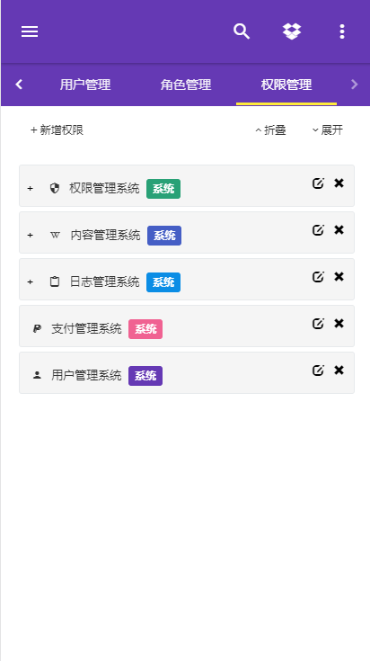
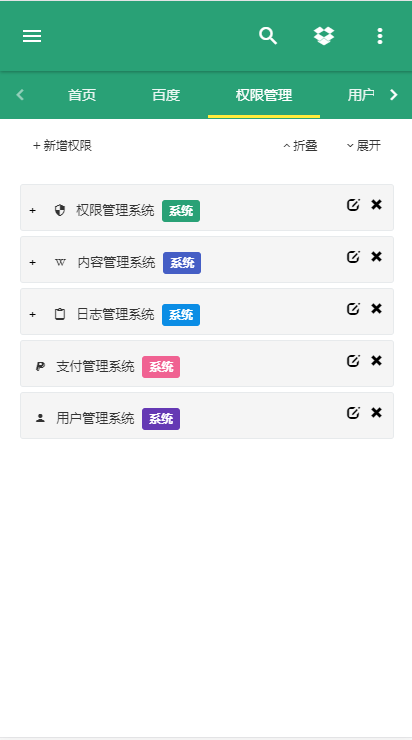
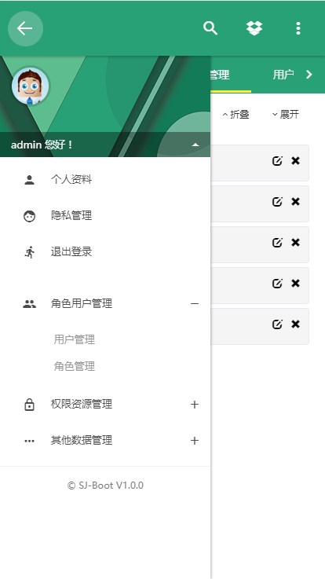

# SanJi Boot

基于Spring Boot 集成一些常用的功能，你只需要基于它做些简单的修改即可，下面是一个功能列表：


## SanJi Boot Security:

使用 JWT token 认证

前后端分离 前端基于 webpack+vue+iview  Material Design风格页面

[前端項目](https://gitee.com/sunxyz/sanji-boot-admin)以完成 80%

 **使用说明**  

前端需要安装 nodejs npm webpack

快速上手指南：


[vue-cli github](https://github.com/vuejs/vue-cli)

[vue-cli](https://vuxjs.gitbooks.io/vux/content/install/vue.html)

[less](http://www.css88.com/doc/less/features/#features-overview-feature)

**准备工作**

```
1.node npm
2.webpack
```

**study**

```
html
css(less)
js
vue
webpack
```
**start**

安装vue-cli
```
npm install -g vue-cli
```
创建vue-cli项目
[指南](https://github.com/vuejs/vue-cli)
```
vue init <template-name> <project-name>
```
coding
```
cd <project-name>
npm install
npm run dev
```


**整合 Spring Security 提供一下功能：**

* [x] 前后端分离

* [x] 权限认证 
 
* [ ] 权限管理
 
* [x] 用户管理 

* [x] 角色管理 

* [ ] 日志管理


### 页面效果：
**电脑端：**


**移动端：**








[查看详情](sanji-boot-security)


## utils

一些小工具 后期会逐渐壮大

### 注意事项：
由于使用了一个自定义的常用功能包需要手动将 [bloom-common.zip](resources/lib/bloom-common.zip)解压后放在本地maven仓库的cn/sunxyz目录下


## share

分享一些优秀的类库,及上手demo

正在规划中......