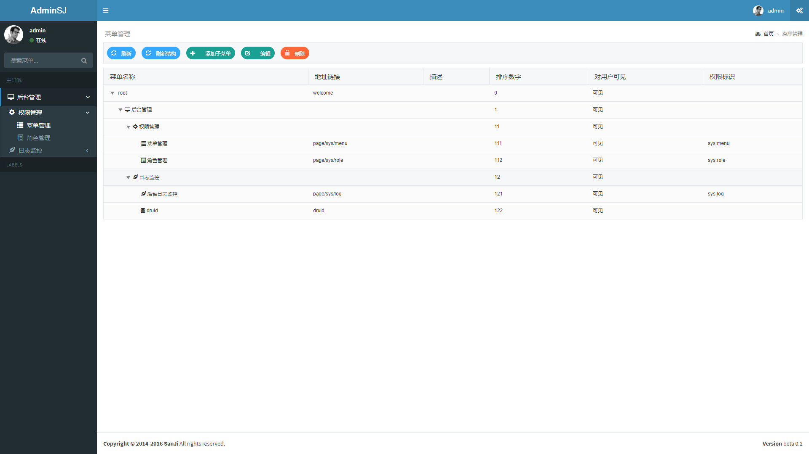
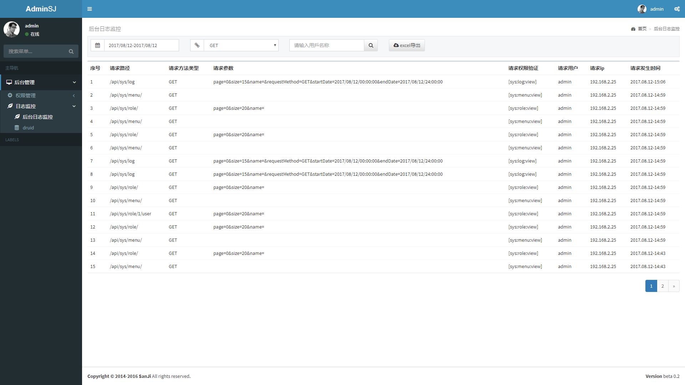

# SanJi Boot

基于Spring Boot 集成一些常用的功能，你只需要基于它做些简单的修改即可，下面是一个功能列表：

[MENU]

## SanJi Boot Shiro:

**整合 Shiro 提供一下功能：**

* [x] 权限认证 

* [x] 权限管理

* [x] 日志管理

* [ ] 用户管理 

### 页面效果：

[查看详情](sanji-boot-shiro)

## SanJi Boot Security: 
整合 Security 
* [x] 前后端分离

* [x] 权限认证 
 
* [x] 权限管理
 
* [x] 日志管理
 
* [x] 用户管理 

### 页面效果：

[查看详情](sanji-boot-security)