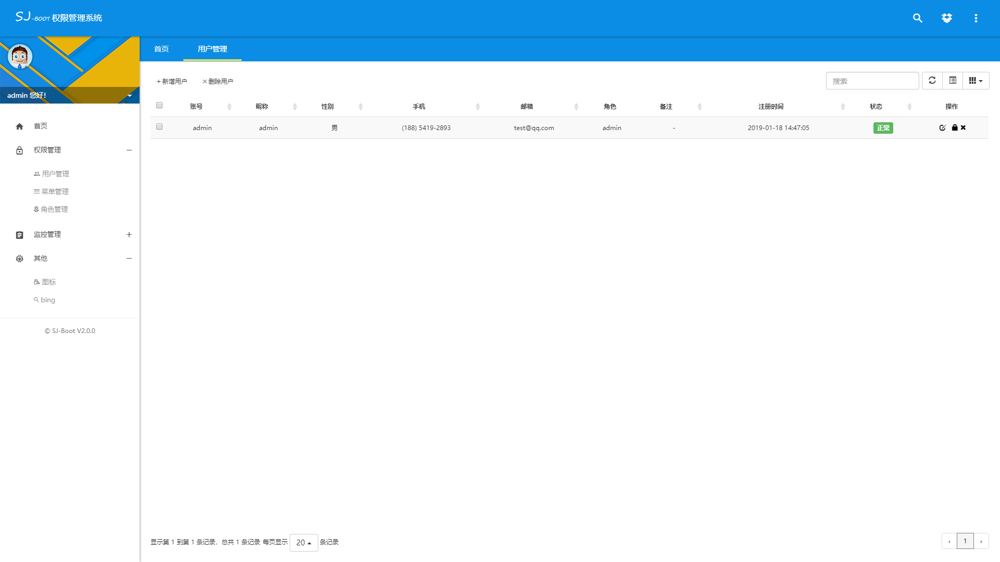
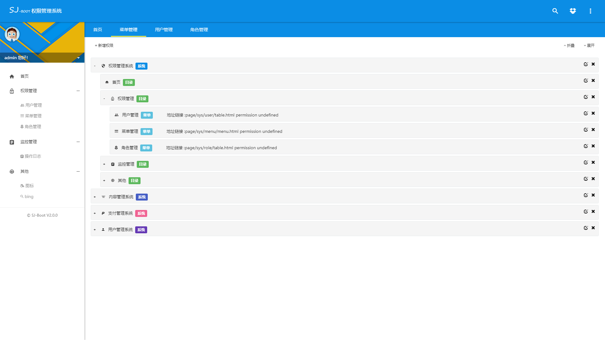
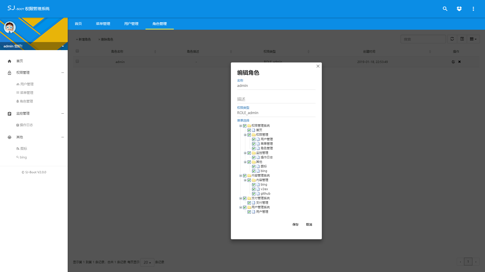
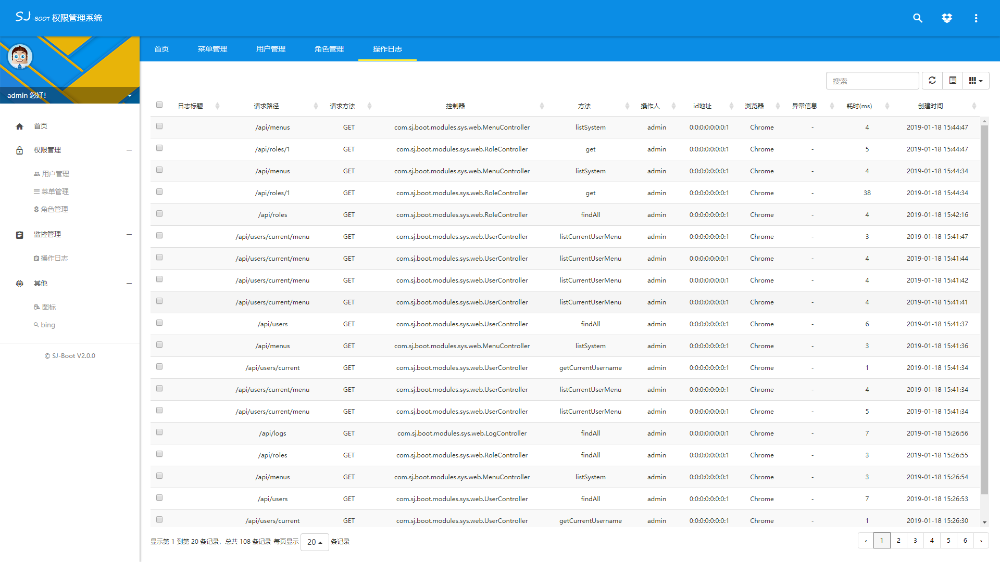
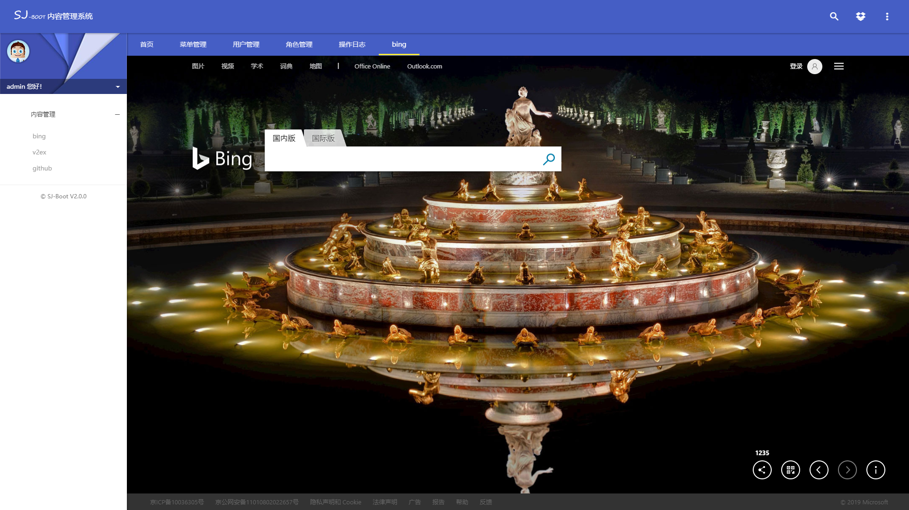

# SanJi Boot  v2.0

>  去繁就简 重新出发

基于Spring Boot 集成一些常用的功能，你只需要基于它做些简单的修改即可。

### 演示环境：

网址: http://47.98.125.142:8086/

用户名/密码: admin/admin

### 功能列表：

* [x] 权限认证 
 
* [x] 权限管理
 
* [x] 用户管理 

* [x] 角色管理 

* [x] 日志管理

### 项目结构
```
sanji-boot
├─java
│  ├─common 公共模块
│  │  ├─spring spring相关的功能
│  │  └─utils 常用工具
│  │ 
│  ├─modules 功能模块
│  │  └─sys 权限模块
│  │ 
│  └─SanjiBootApplication 项目启动类
│  
└─resources 
   ├─static 第三方库、插件等静态资源
   │ ├─app 项目中自己写的css js img 等资源文件
   │ ├─page 页面
   │ └─plugins 第三方库、插件等静态资源
   │ 
   └─application.yml  项目配置文件
```

### 技术栈(技术选型)：

**后端:**

核心框架 ：Spring Boot 2.1.1.RELEASE

安全框架：Apache security

视图框架：Spring MVC

持久层框架：Spring Data JPA

数据库连接池：HikariDataSource

日志管理：LogBack

JSON序列号框架: fastjson

插件: lombok 

**前端:**

主要使用的技术：

渐进式JavaScript 框架：VUE 2.2.0

弹窗框架： jquery-confirm

页面主体框架 ：zhengAdmin

### 效果图











### 扩展

[zhengAdmin](https://github.com/shuzheng/zhengAdmin/blob/master/README.md)

[使用Vue](https://cn.vuejs.org/v2/guide/)

**[Spring Boot 学习资料](https://segmentfault.com/a/1190000008539153)**
