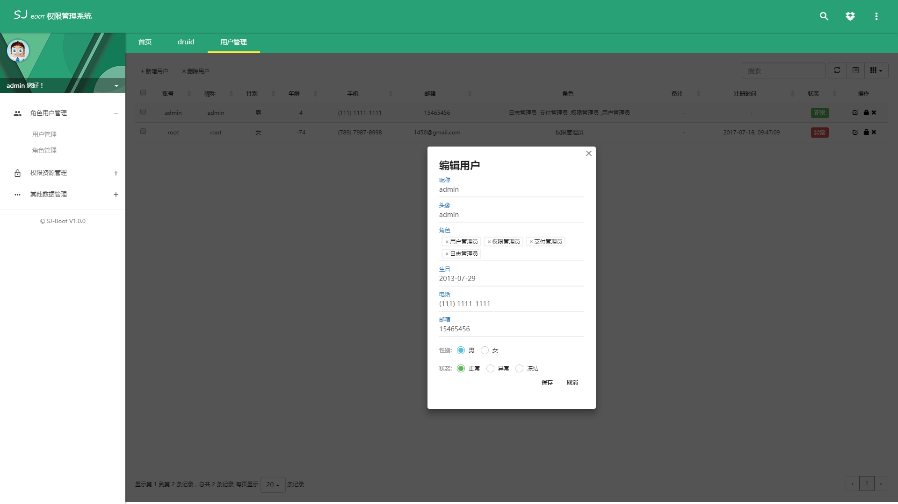
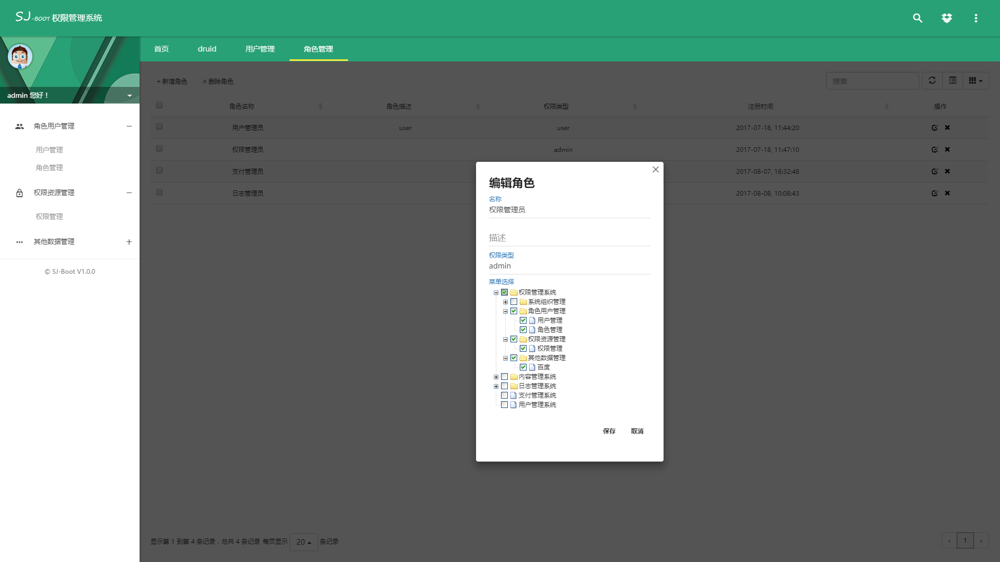
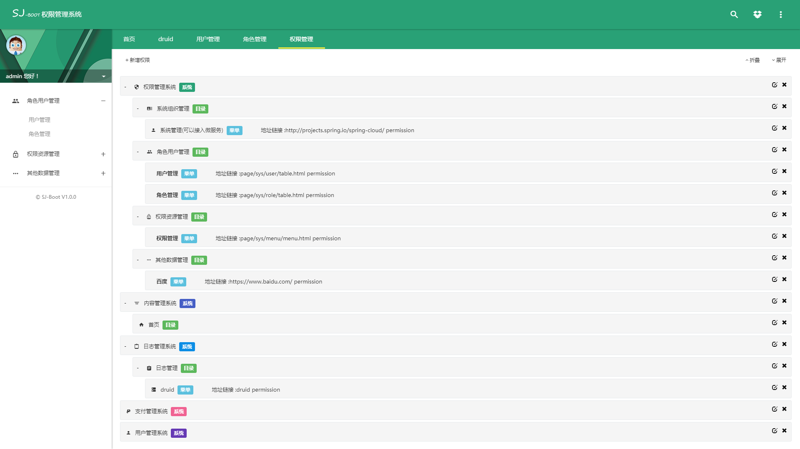
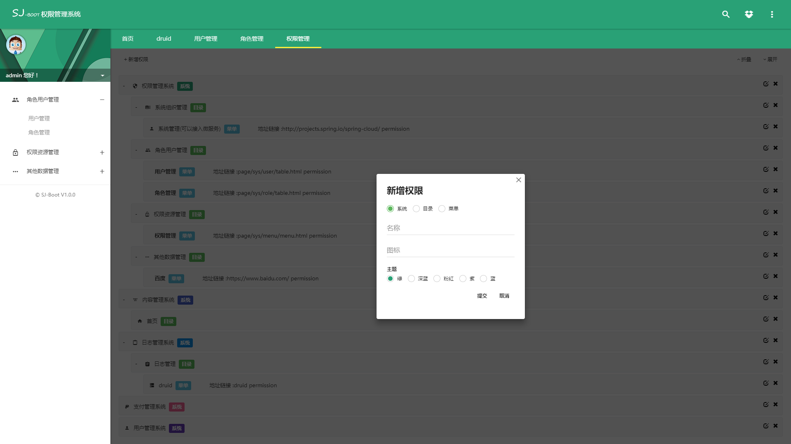
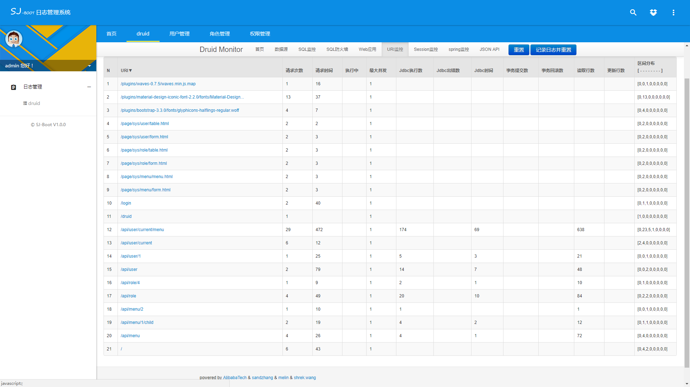

## SanJi Boot Security:

**整合 Security 提供一下功能：**

* [x] 前后端分离

* [x] 权限认证 
 
* [x] 权限管理
 
* [x] 用户管理 

* [x] 角色管理 

* [x] 日志管理

### 页面效果：

### 注意事项

运行项目之前先将 [sanji-boot-security.sql](sanji-boot-security.sql)导入

### 技术栈：

**后端:**

核心框架 ：Spring Boot 1.5.2.RELEASE

安全框架：Apache security

视图框架：Spring MVC

持久层框架：JPA

数据库连接池：Alibaba Druid 1.0.20

日志管理：LogBack

**前端:**

主要使用的技术：

渐进式JavaScript 框架：VUE 2.2.0

弹窗框架： jquery-confirm

页面主体框架 ：zhengAdmin

### 扩展

[了解更多](https://github.com/shuzheng/zhengAdmin/blob/master/README.md)

[使用Vue](https://cn.vuejs.org/v2/guide/)

**[Spring Boot 学习资料](https://segmentfault.com/a/1190000008539153)**
